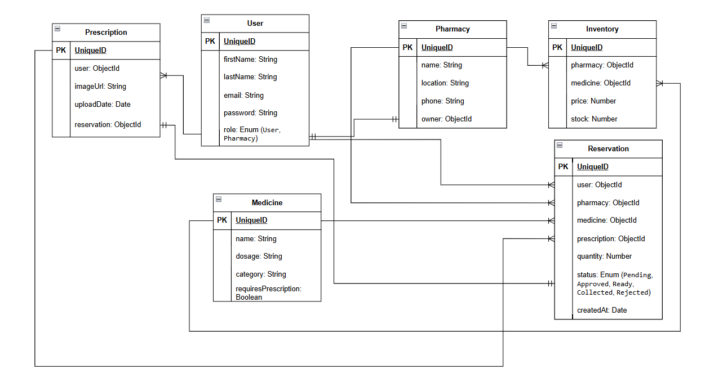

# Dawa ⚕️

## Overview

This repository contains the Node.js, Express and MongoDB backend for **Dawa**.

**Dawa** is a Bahrain-based platform that helps consumers find medicines available at nearby pharmacies without having to call multiple stores. Users can search for a medicine, compare pharmacies based on availability and location, and submit a reservation request. When a prescription is required, the user can securely upload it for the pharmacy to review. Pharmacies remain responsible for verifying prescriptions, confirming availability, and dispensing the medicine.


## Related Links

- **Backend API:** Deployed Backend URL
- **Frontend Application:** Deployed Frontend URL
- **Frontend Repository:** https://github.com/NadiaAlgallaf/Project-4-frontend 

## Technologies Used

- Node.js
- Express
- MongoDB
- Mongoose
- JSON Web Tokens or session authentication
- bcrypt
- dotenv
- Morgan
- Jest
- Supertest


## Features

- User registration
- User login and logout
- Authentication middleware
- CRUD API endpoints
- Request validation
- MongoDB relationships
- Rate Limiting
- Clear Error Handling with proper status codes
- Search and filtering
- Automated API tests
- Role-based or ownership-based authorization
- Any other features you want to highlight


## Project Structure

```text
server/
├── .github/
├── config/
├── controllers/
├── middleware/
├── models/
├── routes/
├── tests/
├── app.js
└── server.js
```

### Folder Responsibilities

| Folder        | Purpose                                         |
| ------------- | ----------------------------------------------- |
| `config`      | Database and application configuration          |
| `controllers` | HTTP request and response handling              |
| `middleware`  | Authentication, validation and error middleware |
| `models`      | Mongoose schemas and models                     |
| `routes`      | Express route definitions                       |
| `tests`       | Automated tests                                 |
| `app.js`      | Express application configuration               |
| `server.js`   | Database connection and server startup          |

## Getting Started

### Prerequisites

Install:

- node.js
- MongoDB locally or a MongoDB Atlas account

## Installation

### 1. Clone the repository

```bash
git clone BACKEND_REPOSITORY_URL
cd BACKEND_REPOSITORY_NAME
```

### 2. Install dependencies

```bash
npm install
```

### 3. Create the environment file

Create `.env` in the root directory:

```env
PORT=3000
MONGODB_URI=your-connection-string
CLIENT_URL=http://localhost:5173
JWT_SECRET=unique-password-no-one-would-guess
```


### 4. Start the development server

```bash
npm run dev
```

The API should be available at:

```text
http://localhost:3000
```

## Database Models


### User

| Field       | Type   | Rules                       |
| ----------- | ------ | --------------------------- |
| `username`  | String | Required, unique, trimmed   |
| `email`     | String | Required, unique, lowercase |
| `password`  | String | Required, hashed            |
| `role`      | String | `user` or `admin`           |
| `createdAt` | Date   | Generated automatically     |
| `updatedAt` | Date   | Generated automatically     |

One table for each model


## Entity Relationships




## API Base URL

Local development:

```text
http://localhost:3000
```

Production:

```text
https://your-deployed-api.com
```

## Endpoints

### Products

| Method   | Endpoint                   | Access        | Description      |
| -------- | -------------------------- | ------------- | ---------------- |
| `GET`    | `/api/products`            | Public        | Get products     |
| `GET`    | `/api/products/:productId` | Public        | Get one product  |
| `POST`   | `/api/products`            | Authenticated | Create a product |
| `PATCH`  | `/api/products/:productId` | Owner/Admin   | Update a product |
| `DELETE` | `/api/products/:productId` | Owner/Admin   | Delete a product |


## Status Codes


| Status | Meaning in this API                |
| -----: | ---------------------------------- |
|  `200` | Successful request                 |
|  `201` | Resource created                   |
|  `204` | Successful deletion with no body   |
|  `400` | Invalid request                    |
|  `401` | Authentication required or invalid |
|  `403` | Authenticated but not permitted    |
|  `404` | Resource not found                 |
|  `409` | Resource conflict                  |
|  `429` | Too many requests                  |
|  `500` | Unexpected server error            |

## Testing

Run tests:

```bash
npm test
```

Tests should use a dedicated test database or an in-memory database.

## Future Enhancements


## Team Members

| Name           | GitHub                              | Responsibilities       | 
| -------------  | ----------------------------------- | ---------------------- |
| Nadia Algallaf | [https://github.com/NadiaAlgallaf ] | Authentication         |
| Shaikha Subah  | [https://github.com/shaikhasubah17] | Product API            |

## Credits
